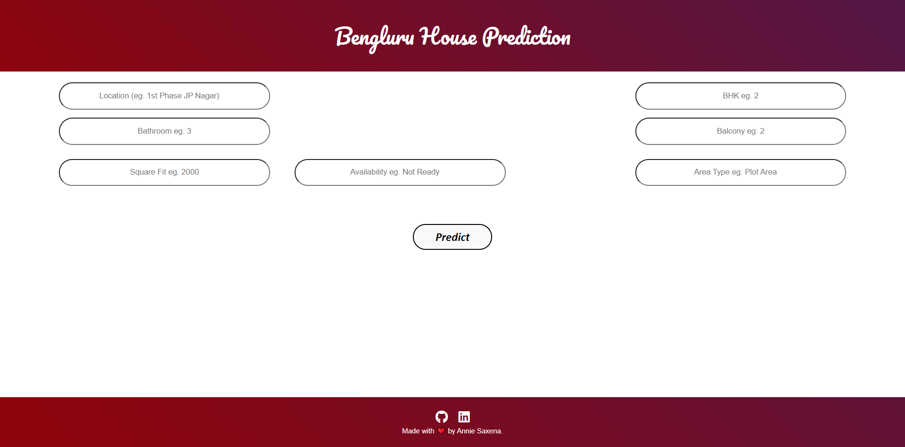

# Real Estate Price Prediction Model

This is a Machine learning model which predicts the Price of House in Bangalore according to the BHK, Number of Bathrooms, Locality, Balcony, Area type and total sqft area.

- Numpy and Pandas for Data Cleaning and Matplotlib for Data Visualization
- Used data science concepts such as data load and cleaning, outlier detection and removal, feature engineering and dimensionality reduction.
- For buidling the model, skelarn and linear regression was used, alongwith data science concepts like gridsearchcv for hyperparameter tunning and k fold cross validation.
( Grid search CV used to get the best score by trying out different algorithms and k fold cross validation used for trying different folds for tests )
- Made a python flask server that uses the saved model to serve http requests. 
- Made a simple frontend using HTML, CSS and JavaScript that allows user to enter home square ft area, bedrooms etc and calls python flask server to retrieve the predicted price.
- Model score = 84.55%
 
- 

 

As we can see, in the above images, for same sqft area, bathrooms and bhk -> Price is different for different localities depending on the price trend there.

Deployed model link - https://price-pred-model.herokuapp.com/
